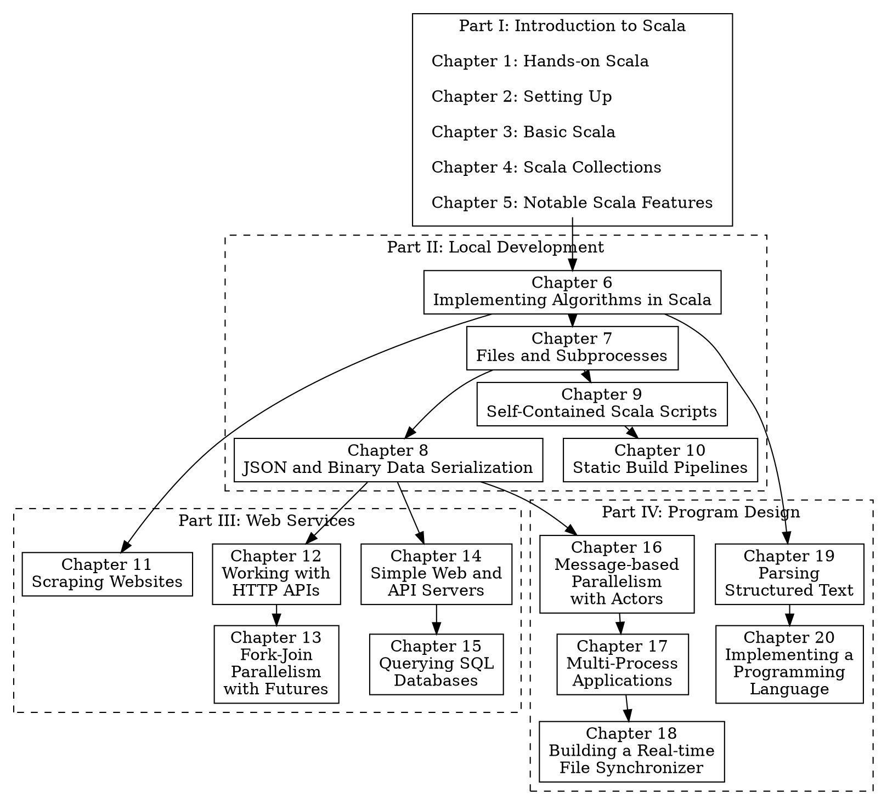

```scala
package app
object MinimalApplication extends cask.MainRoutes {
  @cask.get("/")
  def hello() = {
    "Hello World!"
  }

  initialize()
}
```

`%Snippet 1.1: a tiny Scala web app, one of many example programs we will
encounter in this book`

*Hands-on Scala* teaches you how to use the Scala programming language in a
practical, project-based fashion. Rather than trying to develop expertise in the
deep details of the Scala language itself, *Hands-on Scala* aims to develop
expertise using Scala in a broad range of practical applications. This book
takes you from "hello world" to building interactive websites, parallel web
crawlers, and distributed applications in Scala.

The book covers the concrete skills necessary for anyone using Scala
professionally: handling files, data serializing, querying databases,
concurrency, and so on. *Hands-on Scala* will guide you through completing
several non-trivial projects which reflect the applications you may end up
building as part of a software engineering job. This will let you quickly hit
the ground running using Scala professionally.

-------------------------------------------------------------------------------


*Hands-on Scala* assumes you are a software developer who already has experience
working in another programming language, and want to quickly become productive
working with Scala. If you fall into any of the following categories, this book
is for you.

- Doing big data processing using software like Apache Spark which is written in
  Scala

- Joining one of the many companies using Scala, and need to quickly get up to
  speed

- Hitting performance limits in Ruby or Python, and looking for a faster
  compiled language

- Working with Java or Go, and looking for a language that allows more rapid
  development

- Already experienced working with Scala, but want to take your skills to the
  next level

- Founding a tech startup, looking for a language that can scale with your
  company as it grows

Note that this book is not targeted at complete newcomers to programming. We
expect you to be familiar with basic programming concepts: variables, integers,
conditionals, loops, functions, classes, and so on. We will touch on
any cases where these concepts behave differently in Scala, but expect that you
already have a basic understanding of how they work.

## Why Scala?

Scala combines object-oriented and functional programming in one concise,
high-level language. Scala's static types help avoid bugs in complex
applications, and its JVM (Java Virtual Machine) runtime lets you build
high-performance systems with easy access to a huge ecosystem of tools and
libraries.

Scala is a general-purpose programming language, and has been applied to a wide
variety of problems and domains:

- The Twitter social network has most of its backend systems written in Scala
- The Apache Spark big data engine is implemented using in Scala
- The Chisel hardware design language is built on top of Scala

While Scala has never been as mainstream as languages like Python, Java, or C++,
it remains heavily used in a wide range of companies and open source projects.

### A Compiled Language that feels Dynamic

Scala is a language that scales well from one-line snippets to million-line
production codebases, with the convenience of a scripting language and the
performance and scalability of a compiled language. Scala's conciseness makes
rapid prototyping a joy, while its optimizing compiler and fast JVM runtime
provide great performance to support your heaviest production workloads. Rather
than being forced to learn a different language for each use case, Scala lets
you re-use your existing skills so you can focus your attention on the actual
task at hand.

### Easy Safety and Correctness

Scala's functional programming style and type-checking compiler helps rule out
entire classes of bugs and defects, saving you time and effort you can instead
spend developing features for your users. Rather than fighting `TypeError`s and
`NullPointerException`s in production, Scala surfaces mistakes and issues early
on during compilation so you can resolve them before they impact your bottom
line. Deploy your code with the confidence that you won't get woken up by
outages caused by silly bugs or trivial mistakes.

### A Broad and Deep Ecosystem

As a language running on the Java Virtual Machine, Scala has access to the large
Java ecosystem of standard libraries and tools that you will inevitably need to
build production applications. Whether you are looking for a Protobuf parser, a
machine learning toolkit, a database access library, a profiler to find
bottlenecks, or monitoring tools for your production deployment, Scala has
everything you need to bring your code to production.

## Why This Book?

The goal of *Hands-on Scala* is to make a software engineer productive using the
Scala programming language as quickly as possible.

### Beyond the Scala Language

Most existing Scala books focus on teaching you the language. However, knowing
the minutiae of language details is neither necessary nor sufficient when the
time comes to set up a website, integrate with a third-party API, or structure
non-trivial applications. *Hands-on Scala* aims to bridge that gap.

This book goes beyond the Scala language itself, to also cover the various tools
and libraries you need to use Scala for typical real-world work. *Hands-on
Scala* will ensure you have the supporting skills necessary to use the Scala
language to the fullest.

### Focused on Real Projects

The chapters in *Hands-on Scala* are project-based: every chapter builds up to a
small project in Scala to accomplish something immediately useful in real-world
workplaces. These are followed up with [exercises](#exercises) to consolidate
your knowledge and test your intuition for the topic at hand.

In the course of *Hands-on Scala*, you will work through projects such as:

- An incremental static website generator
- A project migration tool using the Github API
- A parallel web crawler
- An interactive database-backed chat website
- A real-time networked file synchronizer
- A programming language interpreter

These projects serve dual purposes: to motivate the tools and techniques you
will learn about in each chapter, and also to build up your engineering toolbox.
The API clients, web scrapers, file synchronizers, static site generators, web
apps, and other projects you will build are all based on real-world projects
implemented in Scala. By the end of this book, you will have concrete experience
in the specifics tasks common when doing professional work using Scala.

### Code First

*Hands-on Scala* starts and ends with working code. The concepts you learn in
this book are backed up by over 140 executable code examples that demonstrate
the concepts in action, and every chapter ends with a set of exercises with
complete executable solutions. More than just a source of knowledge, *Hands-on
Scala* can also serve as a cookbook you can use to kickstart any project you
work on in future.

*Hands-on Scala* acknowledges that as a reader, your time is valuable. Every
chapter, section and paragraph has been carefully crafted to teach the important
concepts needed and get you to a working application. You can then take your
working code and evolve it into your next project, tool, or product.

## How This Book Is Organized

This book is organized into four parts:

`%Part I Introduction to Scala` is a self-contained introduction to the Scala
language. We assume that you have some background programming before, and aim to
help translate your existing knowledge and apply it to Scala. You will come out
of this familiar with the Scala language itself, ready to begin using it in a
wide variety of interesting use cases.

`%Part II Local Development` explores the core tools and techniques necessary
for writing Scala applications that run on a single computer. We will cover
algorithms, files and subprocess management, data serialization, scripts and
build pipelines. This chapter builds towards a capstone project where we write
an efficient incremental static site generator using the Scala language.

`%Part III Web Services` covers using Scala in a world of servers and clients,
systems and services. We will explore using Scala both as a client and as a
server, exchanging HTML and JSON over HTTP or Websockets. This part builds
towards two capstone projects: a parallel web crawler and an interactive
database-backed chat website, each representing common use cases you are likely
to encounter using Scala in a networked, distributed environment.

`%Part IV Program Design` explores different ways of structuring your Scala
application to tackle real-world problems. This chapter builds towards another
two capstone projects: building a real-time file synchronizer and building a
programming-language interpreter. These projects will give you a glimpse of the
very different ways the Scala language can be used to implement challenging
applications in an elegant and intuitive manner.

Each part is broken down into five chapters, each of which has its own small
projects and exercises. Each chapter contains both small code snippets as well
as entire programs, which can be [accessed via links](#online-materials) for
copy-pasting into your editor or command-line.

The libraries and tools used in this book have their own comprehensive online
documentation. *Hands-on Scala* does not aim to be a comprehensive reference to
every possible topic, but instead will link you to the online documentation if
you wish to learn more. Each chapter will also make note of alternate sets of
libraries or tools that you may encounter using Scala in the wild.

### Chapter Dependency Graph

While *Hands-on Scala* is intended to be read cover-to-cover, you can also pick
and choose which specific topics you want to read about. The following diagram
shows the dependencies between chapters, so you can chart your own path through
the book focusing on the things you are most interested in learning.




## Code Snippet and Examples

In this book, we will be going through a lot of code. As a reader, we expect you
to follow along with the code throughout the chapter: that means working with
your terminal and your editor open, entering and executing the code examples
given. Make sure you execute the code and see it working, to give yourself a
feel for how the code behaves. This section will walk through what you can
expect from the code snippets and examples.

### Command-Line Snippets

Our command-line code snippets will assume you are using `bash` or a compatible
shell like `sh` or `zsh`. On
Windows, the shell can be accessed through Windows Subsystem for Linux. All
these shells behave similarly, and we will be using code snippets prefixed by a
`$` to indicate commands being entered into the Unix shell:

```bash
$ ls
build.sc
foo
mill

$ find . -type f
.
./build.sc
./foo/src/Example.scala
./mill
```

In each case, the command entered is on the line prefixed by `$`, followed by
the expected output of the command, and separated from the next command by an
empty line.

### Scala REPL Snippets

Within Scala, the simplest way to write code is in the Scala REPL
(Read-Eval-Print-Loop). This is an interactive command-line that lets you enter
lines of Scala code to run and immediately see their output. In this book, we
will be using the [Ammonite Scala REPL](http://ammonite.io/), and code snippets
to be entered into the REPL are prefixed by `@`:

```scala
@ 1 + 1
res0: Int = 2

@ println("Hello World")
Hello World
```

In each case, the command entered is on the line prefixed by `@`, with the
following lines being the expected output of the command. The value of the
entered expression may be implicitly printed to the terminal, as is the case for
the `1 + 1` snippet above, or it may be explicitly printed via `println`.

The Ammonite Scala REPL also supports multi-line input, by enclosing the lines
in a curly brace `{}` block:

```scala
@ {
  println("Hello" + (" " * 5) + "World")
  println("Hello" + (" " * 10) + "World")
  println("Hello" + (" " * 15) + "World")
  }
Hello     World
Hello          World
Hello               World
```

This is useful when we want to ensure the code is run as a single unit,
rather than in multiple steps with a delay between them while the user is
typing. Installation of Ammonite will be covered in `%Chapter 2: Setting Up`.

### Source Files

Many examples in this book require source files on disk: these may be run as
scripts, or compiled and run as part of a larger project. All such snippets
contain the name of the file in the top-right corner:


```scala
// build.sc
import mill._, scalalib._

object foo extends ScalaModule {
  def scalaVersion = "2.13.2"
}
```

```scala
// foo/src/Example.scala
package foo
object Example {
  def main(args: Array[String]): Unit = {
    println("Hello World")
  }
}
```

### Diffs

We will illustrate changes to the a file via *diffs*. A diff is a snippet of
code with `+` and `-` indicating the lines that were added and removed:

```diff-scala
   def hello() = {
-    "Hello World!"
+    doctype("html")(
+      html(
+        head(),
+        body(
+          h1("Hello!"),
+          p("World")
+        )
+      )
+    )
   }
```

The above diff represents the removal of one line - `"Hello World!"` - and the
addition of 9 lines of code in its place. This helps focus your attention on the
changes we are making to a program. After we have finished walking through a set
of changes, we will show the full code for the files we were modifying, for easy
reference.

## Online Materials

The following Github repository acts as an online hub for all *Hands-on Scala*
notes, errata, discussion, materials, and code examples:

- https://github.com/handsonscala/handsonscala

### Code Snippets

Every code snippet in this book is available in the `snippets/` folder of the
*Hands-on Scala* online repository:

- https://github.com/handsonscala/handsonscala/blob/v1/snippets

For example the code snippet with the following tag:

- `</> 1.1.scala`

Is available at the following URL:

- https://github.com/handsonscala/handsonscala/blob/v1/snippets/1.1.scala

This lets you copy-paste code where convenient, rather than tediously typing out
the code snippets by hand. Note that these snippets may include diffs and
fragments that are not executable on their own. For executable examples, this
book also provides complete
[Executable Code Examples](#executable-code-examples).

### Executable Code Examples

The code presented in this book is executable, and by following the instructions
and code snippets in each chapter you should be able to run and reproduce all
examples shown. *Hands-on Scala* also provides a set of complete executable
examples online at:

- https://github.com/handsonscala/handsonscala/blob/v1/examples

Each of the examples in the `handsonscala/handsonscala` repository contains a
`readme.md` file containing the command necessary to run that example.
Throughout the book, we will refer to the online examples via callouts such as:

> %example 6.1 - MergeSort

As we progress through each chapter, we will often start from an initial piece
of code and modify it via [Diffs](#diffs) or [Code Snippets](#code-snippets) to
produce the final program. The intermediate programs would be too verbose to
show in full at every step in the process, but these executable code examples
give you a chance to see the complete working code at each stage of
modification.

Each example is fully self-contained: following the setup in `%Chapter 2:
Setting Up`, you can run the command in each folder's `readme.md` and see the
code execute in a self-contained fashion. You can use the working code as a
basis for experimentation, or build upon it to create your own programs and
applications. All code snippets and examples in this book are MIT licensed.

### Exercises

Starting from chapter 5, every chapter come with some exercises at the end:

> %exercise 6.7 - ImmutableTrie
>
> Tries can come in both mutable and immutable variants. Define an
> `ImmutableTrie` class that has the same methods as the `Trie` class we
> discussed in this chapter, but instead of a `def add` method it should take a
> sequence of strings during construction and construct the data structure
> without any use of `var`s or `mutable` collections.

The goal of these exercises is to synthesize what you learned in the chapter
into useful skills. Some exercises ask you to make use of what you learned to
write new code, others ask you to modify the code presented in the chapter,
while others ask you to combine techniques from multiple chapters to achieve
some outcome. These will help you consolidate what you learned and build a solid
foundation that you can apply to future tasks and challenges.

The solutions to these exercises are also available online as executable code
examples.

### Resources

The last set of files in the `handsonscala/handsonscala` Github respository are the
*resources*: sample data files that are used to exercise the code in a chapter.
These are available at:

- https://github.com/handsonscala/handsonscala/blob/v1/resources

For the chapters that make use of these resource files, you can download them by
going to the linked file on Github, clicking the `Raw` button to view the raw
contents of the file in the browser, and then `Cmd-S`/`Ctrl-S` to save the file
to your disk for your code to access.

### Online Discussion

For further help or discussion about this book, feel free to visit our online
chat room below. There you may be able to find other readers to compare notes
with or discuss the topics presented in this book:

- http://www.handsonscala.com/chat

There are also chapter-specific discussion threads, which will be linked to at
the end of each chapter. You can use these threads to discuss topics specific to
each chapter, without it getting mixed up in other discussion. A full listing of
these chapter-specific discussion threads can be found at the following URLs:

- http://www.handsonscala.com/discuss (listing of all chapter discussions)
- http://www.handsonscala.com/discuss/2 (chapter 2 discussion)

## Conclusion

This first chapter should have given you an idea of what this book is about, and
what you can expect working your way through it. Now that we have covered how
this book works, we will proceed to set up your Scala development environment
that you will be using for the rest of this book.
