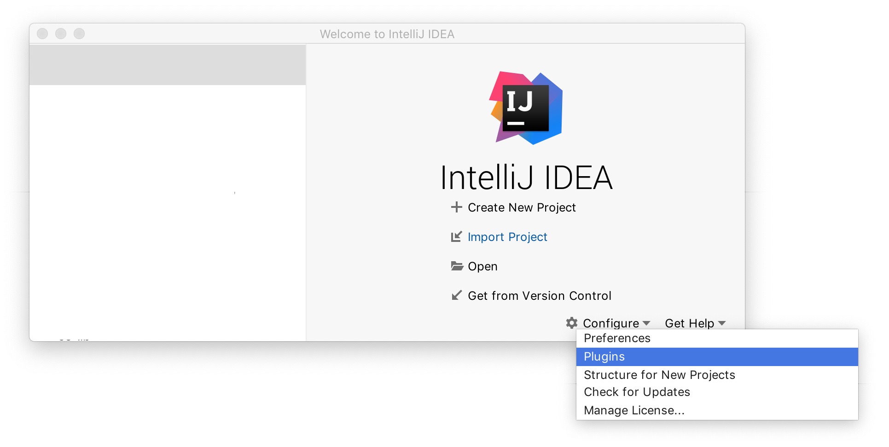
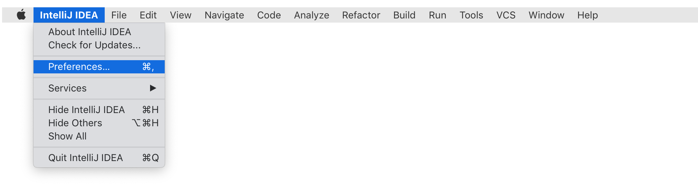
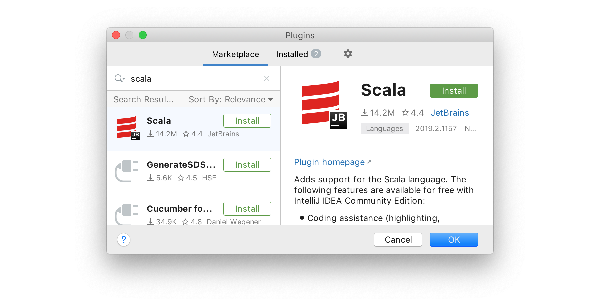
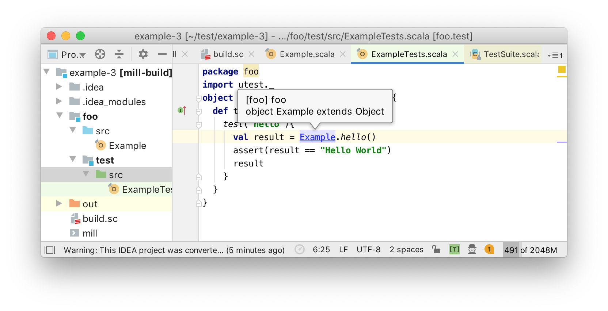
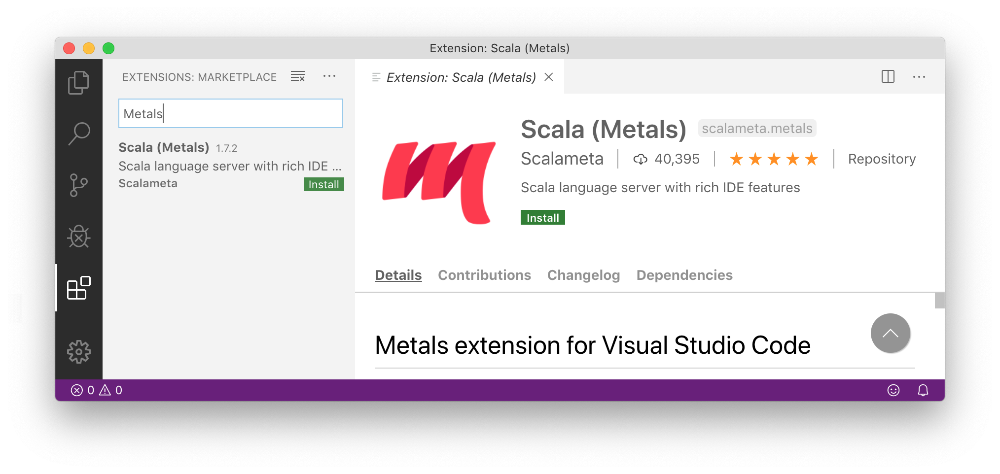
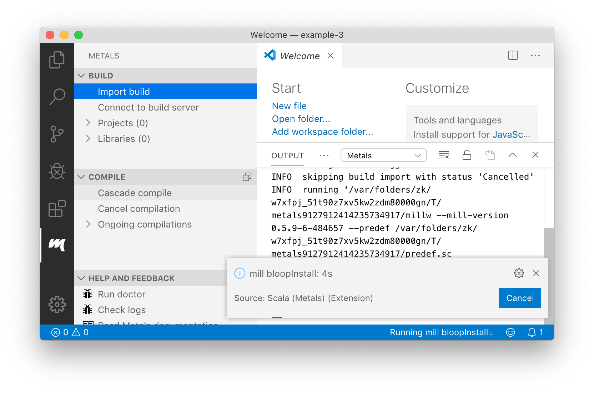
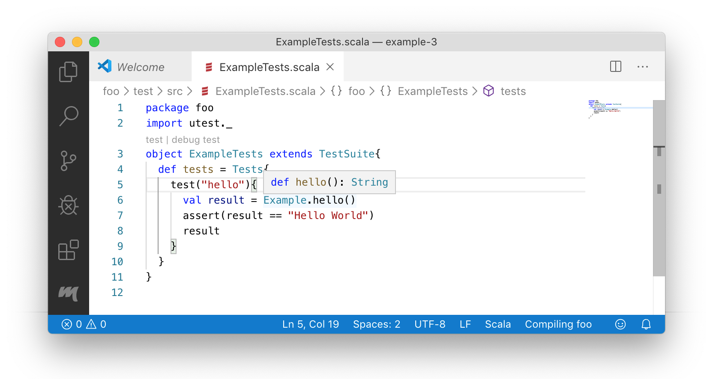

```scala
$ amm
Loading...
Welcome to the Ammonite Repl 2.2.0 (Scala 2.13.2 Java 11.0.7)
@ 1 + 1
res0: Int = 2

@ println("hello world" + "!" * 10)
hello world!!!!!!!!!!
```

`%Snippet 2.1: getting started with the Ammonite Scala REPL`

In this chapter, we will set up a simple Scala programming environment, giving
you the ability to write, run, and test your Scala code. We will use this setup
throughout the rest of the book. It will be a simple setup, but enough so you
can get productive immediately with the Scala language.

Setting up your development environment is a crucial step in learning a new
programming language. Make sure you get the setup in this chapter working. If
you have issues, come to the online chat room https://www.handsonscala.com/chat
to get help resolving them so you can proceed with the rest of the book in peace
without tooling-related distractions.

-------------------------------------------------------------------------------

We will be installing following tools for writing and running Scala code:

- Java, the underlying runtime which Scala runs on
- Ammonite, a lightweight REPL and script runner
- Mill, a build tool for larger Scala projects
- Intellij IDEA, an integrated development environment that supports Scala
- VSCode, a lightweight text editor with support for Scala

These tools will be all you need from your first line of Scala code to
building and deploying production systems in Scala.

## Windows Setup (Optional)

If you are on Windows, the easiest way to get started using Scala is to use the
*Windows Subsystem for Linux 2* (WSL2) to provide a unix-like environment to run
your code in. This can be done by following the documentation on the Microsoft
website:

- https://docs.microsoft.com/en-us/windows/wsl/wsl2-install

WSL2 allows you to choose which Linux environment to host on your Windows
computer. For this book, we will be using Ubuntu 18.04 LTS.

Completing the setup, you should have a Ubuntu terminal open with a standard
linux filesystem and your Windows filesystem available under the `/mnt/c/`
folder:

```bash
$ cd /mnt/c

$ ls
'Documents and Settings'    PerfLogs        'Program Files (x86)'   Recovery
'Program Files'             ProgramData     Recovery.txt            Users
...
```

The files in `/mnt/c/` are shared between your Windows environment and your
Linux environment:

- You can edit your code on Windows, and run it through the terminal on Linux.

- You can generate files on disk on Linux, and view them in the Windows Explorer

Many of the chapters in this book assume you are running your code in WSL2's
Ubuntu/Linux environment, while graphical editors like IntelliJ or VSCode will
need to be running on your Windows environment, and WSL2 allows you to swap
between Linux and Windows seamlessly. While the Scala language can also be
developed directly on Windows, using WSL2 will allow you to avoid compatibility
issues and other distractions as you work through this book.

## Installing Java

Scala is a language that runs on the Java Virtual Machine (JVM), and needs Java
pre-installed in order to run. To check if you have Java installed, open up your
command line (The `Terminal` app on Mac OS-X, WSL2/Ubuntu on Windows) and type
in the `java -version` command. If you see the following output (or something
similar) it means you already have Java installed:

```bash
$ java -version
openjdk version "11.0.7" 2020-04-14
OpenJDK Runtime Environment AdoptOpenJDK (build 11.0.7+9)
OpenJDK 64-Bit Server VM AdoptOpenJDK (build 11.0.7+9, mixed mode)
```

If you already have Java, you can skip forward to
[Installing Ammonite](#installing-ammonite). On the other hand, if you see
something like the following, it means you do not have Java installed yet:

```bash
$ java -version
-bash: java: command not found
```

You can download and install a version of the JVM (we will be using version 11
in our examples) via one of the following websites:

- [https://adoptopenjdk.net/?variant=openjdk11&jvmVariant=hotspot](https://adoptopenjdk.net/?variant=openjdk11&jvmVariant=hotspot)
- [https://docs.aws.amazon.com/corretto/latest/corretto-11-ug/downloads-list.html](https://docs.aws.amazon.com/corretto/latest/corretto-11-ug/downloads-list.html)

The installation instructions vary per operating system, but there are
instructions provided for Windows, Mac OS-X, and different flavors of Linux
(`.deb` and `.rpm` bundles). Once you have downloaded and installed Java, go
back to your command line and make sure that running the `java -version` command
correctly produces the above output.

If you are installing Java through the terminal, e.g. on a WSL Ubuntu
distribution or on a headless server, you can do so through your standard
package manager. e.g. on Ubuntu 18.04 that would mean the following commands:

```bash
$ sudo apt update

$ sudo apt install default-jdk

$ java -version
openjdk version "11.0.6" 2020-01-14
OpenJDK Runtime Environment (build 11.0.6+10-post-Ubuntu1ubuntu118.04.1)
OpenJDK 64-Bit Server VM (build 11.0.6+10-post-Ubuntu-1ubuntu118.04.1, ...)
```

Java versions have a high degree of compatibility, so as long as you have some
version of Java installed that should be enough to make the examples in this
book work regardless of which specific version it is.

## Installing Ammonite

On Mac OS-X, Linux, and Windows WSL2, we can install Ammonite via the following
command line commands:

```bash
$ sudo curl -L https://github.com/lihaoyi/Ammonite/releases/download/2.2.0/2.13-2.2.0 \
  -o /usr/local/bin/amm

$ sudo chmod +x /usr/local/bin/amm

$ amm
```

This should open up the following Ammonite Scala REPL:

```scala
Loading...
Welcome to the Ammonite Repl 2.2.0 (Scala 2.13.2 Java 11.0.7)
@
```

Once you see this output, it means you are ready to go. You can exit Ammonite
using `Ctrl-D`.

On Max OS-X, Ammonite is also available through the Homebrew package manager via
`brew install ammonite-repl`

### The Scala REPL

The Ammonite REPL is an interactive Scala command-line in which you can enter
code expressions and have their result printed:

```scala
@ 1 + 1
res0: Int = 2

@ "i am cow".substring(2, 4)
res1: String = "am"
```

Invalid code prints an error:

```scala
@ "i am cow".substing(2, 3)
cmd0.sc:1: value substing is not a member of String
did you mean substring?
val res0 = "i am cow".substing(2, 3)
                      ^
Compilation Failed
```

You can use tab-completion after a `.` to display the available methods on a
particular object, a partial method name to filter that listing, or a complete
method name to display the method signatures:

```scala
@ "i am cow".<tab>
...
exists                   maxOption                stripSuffix              ||
filter                   min                      stripTrailing
filterNot                minBy                    subSequence
find                     minByOption              substring

@ "i am cow".sub<tab>
subSequence   substring

@ "i am cow".substring<tab>
def substring(x$1: Int): String
def substring(x$1: Int, x$2: Int): String
```

If a REPL command is taking too long to run, you can kill it via `Ctrl-C`:

```scala
@ while (true) { Thread.sleep(1000); println(1 + 1) } // loop forever
2
2
2
2
2
<Ctrl-C>
Interrupted! (`repl.lastException.printStackTrace` for details)

@
```


### Scala Scripts

In addition to providing a REPL, Ammonite can run Scala Script files. A Scala
Script is any file containing Scala code, ending in `.sc`. Scala Scripts are a
lightweight way of running Scala code that is more convenient, though less
configurable, than using a fully-featured build tool like Mill.

For example, we can create the
following file `myScript.sc`, using any text editor of your choice
([Vim](https://www.vim.org/), [Sublime Text](https://www.sublimetext.com/),
[VSCode](https://code.visualstudio.com/), etc.):

```scala
// myScript.sc
println(1 + 1) // 2

println("hello" + " " + "world") // hello world

println(List("I", "am", "cow")) // List(I,am,cow)
```

Note that in scripts, you need to `println` each expression since scripts do not
echo out their values. After that, you can then run the script via `amm
myScript.sc`:

```bash
$ amm myScript.sc
Compiling /Users/lihaoyi/myScript.sc
2
hello world
List(I, am, cow)
```

The first time you run the script file, it will take a moment to compile the
script to an executable. Subsequent runs will be faster since the script is
already compiled.

#### Watching Scripts

If you are working on a single script, you can use the `amm -w` or `amm --watch`
command to watch a script and re-run it when things change:

```bash
$ amm -w myScript.sc
2
hello world
am
Watching for changes to 2 files... (Ctrl-C to exit)
```

Now whenever you make changes to the script file, it will automatically get
re-compiled and re-run. This is much faster than running it over and over
manually, and is convenient when you are actively working on a single script to
try and get it right.

You can edit your Scala scripts with whatever editor you feel comfortable with:
[IntelliJ](#installing-intellij-for-scala),
[VSCode](#visual-studio-code-support), or any other text editor.

### Using Scripts from the REPL

You can open up a REPL with access to the functions in a Scala Script by running
`amm` with the `--predef` flag. For example, given the following script:

```scala
// myScript.sc
def hello(n: Int) = {
  "hello world" + "!" * n
}
```

You can then open a REPL with access to it as follows:

```bash
$ amm --predef myScript.sc
Loading...
Welcome to the Ammonite Repl 2.2.0 (Scala 2.13.2 Java 11.0.7)
@ hello(12)
res0: String = "hello world!!!!!!!!!!!!"
```

This is convenient when your code snippet is large enough that you want to save
it to a file and edit it in a proper editor, but you still want to use the Scala
REPL to interactively test its behavior.

Note that if you make changes to the script file, you need to exit the REPL
using `Ctrl-D` and re-open it to make use of the modified script. You can also
combine `--predef` with `--watch`/`-w`, in which case when you exit with `Ctrl-D`
it will automatically restart the REPL if the script file has changed.

## Installing Mill

Mill is a build tool for Scala projects, designed for working with larger Scala
projects. While the Ammonite REPL and scripts are great for small pieces of
code, they lack support for things like running unit tests, packaging your code,
deployment, and other such tasks. For larger projects that require such things,
you need to use a build tool like Mill.

### Mill Projects

The easiest way to get started with Mill is to download the example project:

```bash
$ curl -L https://github.com/lihaoyi/mill/releases/download/0.8.0/0.8.0-example-3.zip \
  -o example-3.zip

$ unzip example-3.zip

$ cd example-3

$ find . -type f
./build.sc
./mill
./foo/test/src/ExampleTests.scala
./foo/src/Example.scala
```

You can see that the example project has 4 files. A `build.sc` file that
contains the project definition, defining a module `foo` with a test module
`test` inside:

```scala
// build.sc
import mill._, scalalib._

object foo extends ScalaModule {
  def scalaVersion = "2.13.2"
  object test extends Tests {
    def ivyDeps = Agg(ivy"com.lihaoyi::utest:0.7.4")
    def testFrameworks = Seq("utest.runner.Framework")
  }
}
```

The `test` module definition above comes with a dependency on one third party
library: `ivy"com.lihaoyi::utest:0.7.4"`. We will see other libraries as we
progress through the book and how to use them in our Mill projects.

The Scala code for the `foo` module lives inside the `foo/src/` folder:

```scala
// foo/src/Example.scala
package foo
object Example {
  def main(args: Array[String]): Unit = {
    println(hello())
  }
  def hello(): String = "Hello World"
}
```

While the Scala code for the `foo.test` test module lives inside the
`foo/test/src/` folder:

```scala
// foo/test/src/ExampleTests.scala
package foo
import utest._
object ExampleTests extends TestSuite {
  def tests = Tests {
    test("hello") {
      val result = Example.hello()
      assert(result == "Hello World")
      result
    }
  }
}
```

Lastly, the example project contains a `mill` file. You can use the `mill` file
to compile and run the project, via `./mill ...`:

```bash
$ ./mill foo.compile
Compiling /Users/lihaoyi/test2/example-1/build.sc
...
7 warnings found
[info] Compiling 1 Scala source to /Users/lihaoyi/test2/example-1/out/foo/compile/dest...
[info] Done compiling.

$ ./mill foo.run
Hello World
```

Note that the first time you run `./mill`, it will take a few seconds to
download the correct version of Mill for you to use. While above we run both
`./mill foo.compile` and `./mill foo.run`, if you want to run your code you can
always just run `./mill foo.run`. Mill will automatically re-compile your code
if necessary before running it.

To use Mill in any other project, or to start a brand-new project using Mill, it
is enough to copy over the `mill` script file to that project's root directory.
You can also download the startup script via:

```bash
$ curl -L https://github.com/lihaoyi/mill/releases/download/0.8.0/0.8.0 -o mill

$ chmod +x mill
```

### Running Unit Tests

To get started with testing in Mill, you can run `./mill foo.test`:

```bash
$ ./mill foo.test
-------------------------------- Running Tests --------------------------------
+ foo.ExampleTests.hello 10ms  Hello World
```

This shows the successful result of the one test that comes built in to the
example repository.

### Creating a Stand-Alone Executable

So far, we have only been running code within the Mill build tool. But what if
we want to prepare our code to run without Mill, e.g. to deploy it to production
systems? To do so, you can run `./mill foo.assembly`:

```scala
$ ./mill foo.assembly
```

This creates an `out.jar` file that can be distributed, deployed and run without
the Mill build tool in place. By default, Mill creates the output for the
`foo.assembly` task in `out/foo/assembly/dest`, but you can use `./mill show` to
print out the full path:

```scala
$ ./mill show foo.assembly
"ref:18e58778:/Users/lihaoyi/test/example-3/out/foo/assembly/dest/out.jar"
```

You can run the executable assembly to verify that it does what you expect:

```bash
$ out/foo/assembly/dest/out.jar
Hello World
```

Now your code is ready to be deployed!

In general, running Scala code in a Mill project requires a bit more setup than
running it interactively in the Ammonite Scala REPL or Scala Scripts, but the
ability to easily test and package your code is crucial for any production
software.

## IDE Support

The most common editors used for working with Scala programs is IntelliJ or
VSCode. This section will walk you through installing both of them, but you only
really need to install whichever one you prefer to make your way through this
book.

### Installing IntelliJ for Scala

You can install IntelliJ from the following website. The free Community edition
will be enough.

- [https://www.jetbrains.com/idea/download](https://www.jetbrains.com/idea/download)

Next, we need to install the IntelliJ Scala plugin, either via the loading
screen:



or via the menu bar



From there, go to the `Plugins` page:



Search for `Scala` and click `Install`. You will then need to re-start the
editor.

### Integrating IntelliJ with Mill

Once you have IntelliJ installed on your machine, you can load your Mill project
via the following terminal command:

```bash
$ ./mill mill.scalalib.GenIdea/idea
```

Next, use IntelliJ's `File / Open` menu item and select the folder your
`build.sc` file is in. That will open up the Mill project, with IntelliJ
providing code assistance when editing all the code:



You may see a `Project JDK is not defined: Setup JDK` prompt: in that case,
click the `Setup JDK` link and select the version of Java that you
[installed earlier](#installing-java). Note that every time you make changes to
add dependencies or add new modules to your `build.sc`, you need to re-run the
`./mill mill.scalalib.GenIdea/idea` command, and restart IntelliJ to have it
pick up the changes.

### Visual Studio Code Support

Scala also comes with support for the Visual Studio Code text editor, via the
Metals plugin:

- https://code.visualstudio.com/



To use VSCode within a Mill build, we need to specify the Mill version in a
`.mill-version` file. Then you can open the folder that your Mill build is in
and select `Import build`:

```bash
$ echo "0.8.0" > .mill-version
```



Sometimes the import may time out if your computer is slow or under load, and
may need to be retried. If you have trouble getting the import to work even
after retrying, you can try using a more recent version of the Metals plugin.
Use `F1`, search for `Open Settings (UI)`, and update `Extensions > Metals >
Server Version` e.g. to the latest SNAPSHOT version on the Metals/VSCode
website:

- https://scalameta.org/metals/docs/editors/vscode.html#using-latest-metals-snapshot

You can also try enabling VSCode Remote Development, by using `F1` and searching
for `Remote-WSL: Reopen in WSL`. This will run the VSCode code analysis logic
inside the Ubuntu virtual machine, which may be more reliable than doing so
directly on the Windows host environment:

- https://code.visualstudio.com/docs/remote/wsl

Once complete, you should be able to show method signature by mousing over them
with `Cmd` or `Ctrl`.



Metals also supports other editors such as Vim, Sublime Text, Atom, and others.
For more details, refer to their documentation for how to install the relevant
editor plugin:

- https://scalameta.org/metals/docs/editors/overview.html

## Conclusion

By now, you should have three main things set up:

- Your Ammonite Scala REPL and Script Runner, that you can run via `amm` or `amm
  myScript.sc`
- A Mill example project, which you can run via `./mill foo.run` or test via
  `./mill foo.test`
- Either IntelliJ or VSCode support for your Mill example projects

We will be using Mill as the primary build tool throughout this book, as it is
the easiest to get started with. You may also encounter alternate build tools in
the wild:

- SBT: https://www.scala-sbt.org/
- Gradle: https://docs.gradle.org/current/userguide/scala_plugin.html
- Maven: https://docs.scala-lang.org/tutorials/scala-with-maven.html

Before you move on to the following chapters, take some time to experiment with
these tools: write some code in the Ammonite REPL, create some more scripts, add
code and tests to the Mill example projects and run them. These are the main
tools that we will use throughout this book.
