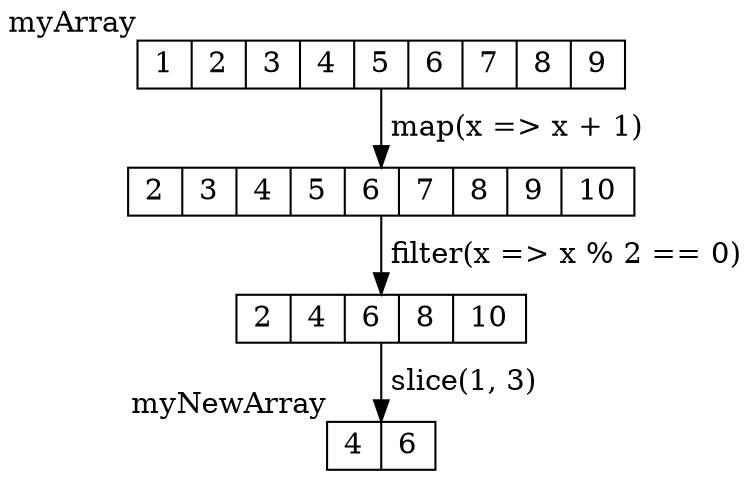
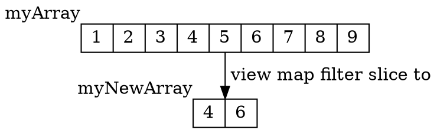
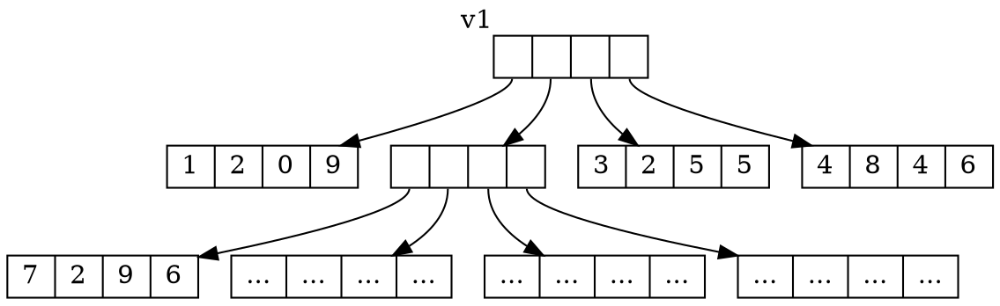
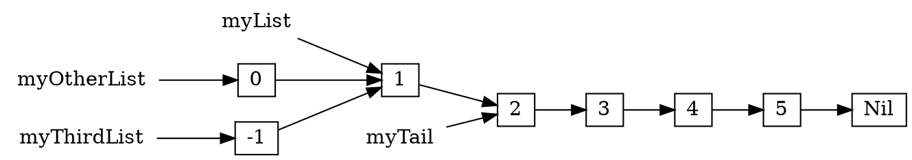
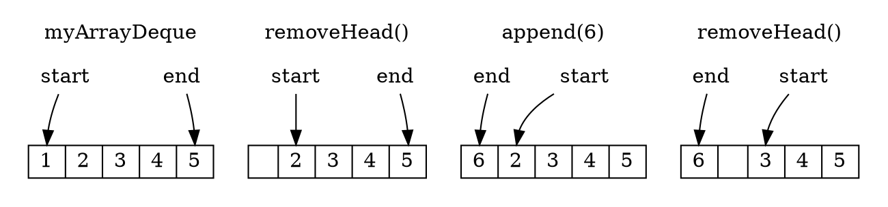
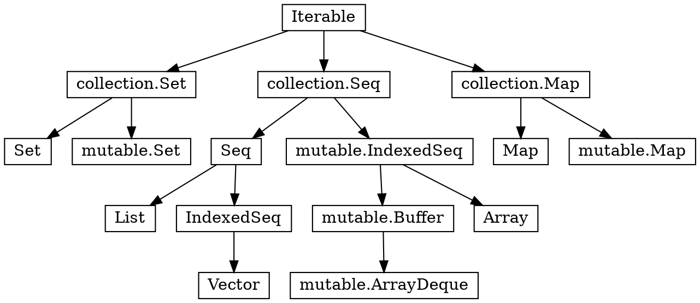

```scala
@ def stdDev(a: Array[Double]): Double = {
    val mean = a.sum / a.length
    val squareErrors = a.map(x => x - mean).map(x => x * x)
    math.sqrt(squareErrors.sum / a.length)
  }
```

`%Snippet 4.1: calculating the standard deviation of an array using Scala
Collection operations`


The core of the Scala standard library is its *collections*: a common set of
containers and data structures that are shared by all Scala programs. Scala's
collections make it easy for you to manipulate arrays, linked lists, sets, maps
and other data structures in convenient ways, providing built-in many of the
data structures needed for implementing a typical application.

This chapter will walk through the common operations that apply to all
collection types, before discussing the individual data structures and when you
might use each of them in practice.


-------------------------------------------------------------------------------

## Operations

Scala collections provide many common operations for constructing them, querying
them, or transforming them. These operations are present on the `Array`s we saw
in `%Chapter 3: Basic Scala`, but they also apply to all the collections we will
cover in this chapter: [Vectors](#immutable-vectors), [Sets](#immutable-sets),
[Maps](#immutable-maps), etc.

### Builders

```scala
@ val b = Array.newBuilder[Int]
b: mutable.ArrayBuilder[Int] = ArrayBuilder.ofInt

@ b += 1

@ b += 2

@ b.result()
res3: Array[Int] = Array(1, 2)
```

Builders let you efficiently construct a collection of unknown length,
"freezing" it into the collection you want at the end. This is most useful for
constructing `Array`s or immutable collections where you cannot add or remove
elements once the collection has been constructed.

### Factory Methods

```scala
@ Array.fill(5)("hello") // Array with "hello" repeated 5 times
res4: Array[String] = Array("hello", "hello", "hello", "hello", "hello")

@ Array.tabulate(5)(n => s"hello $n") // Array with 5 items, each computed from its index
res5: Array[String] = Array("hello 0", "hello 1", "hello 2", "hello 3", "hello 4")

@ Array(1, 2, 3) ++ Array(4, 5, 6) // Concatenating two Arrays into a larger one
res6: Array[Int] = Array(1, 2, 3, 4, 5, 6)
```

Factory methods provide another way to instantiate collections: with every
element the same, with each element constructed depending on the index, or from
multiple smaller collections. This can be more convenient than using
[Builders](#builders) in many common use cases.

> %example 1 - BuildersFactories

### Transforms

```scala
@ Array(1, 2, 3, 4, 5).map(i => i * 2) // Multiply every element by 2
res7: Array[Int] = Array(2, 4, 6, 8, 10)

@ Array(1, 2, 3, 4, 5).filter(i => i % 2 == 1) // Keep only elements not divisible by 2
res8: Array[Int] = Array(1, 3, 5)

@ Array(1, 2, 3, 4, 5).take(2) // Keep first two elements
res9: Array[Int] = Array(1, 2)

@ Array(1, 2, 3, 4, 5).drop(2) // Discard first two elements
res10: Array[Int] = Array(3, 4, 5)

@ Array(1, 2, 3, 4, 5).slice(1, 4) // Keep elements from index 1-4
res11: Array[Int] = Array(2, 3, 4)

@ Array(1, 2, 3, 4, 5, 4, 3, 2, 1, 2, 3, 4, 5, 6, 7, 8).distinct // Removes all duplicates
res12: Array[Int] = Array(1, 2, 3, 4, 5, 6, 7, 8)
```


Transforms take an existing collection and create a new collection modified in
some way. Note that these transformations create copies of the collection, and
leave the original unchanged. That means if you are still using the original
array, its contents will not be modified by the transform:

```scala
@ val a = Array(1, 2, 3, 4, 5)
a: Array[Int] = Array(1, 2, 3, 4, 5)

@ val a2 = a.map(x => x + 10)
a2: Array[Int] = Array(11, 12, 13, 14, 15)

@ a(0) // Note that `a` is unchanged!
res15: Int = 1

@ a2(0)
res16: Int = 11
```

The copying involved in these collection transformations does have some
overhead, but in most cases that should not cause issues. If a piece of code
does turn out to be a bottleneck that is slowing down your program, you can
always convert your `.map`/`.filter`/etc. transformation code into mutating
operations over raw `Array`s or [In-Place Operations](#in-place-operations) over
[Mutable Collections](#mutable-collections) to optimize for performance.

> %example 2 - Transforms

### Queries

```scala
@ Array(1, 2, 3, 4, 5, 6, 7).find(i => i % 2 == 0 && i > 4)
res17: Option[Int] = Some(6)

@ Array(1, 2, 3, 4, 5, 6, 7).find(i => i % 2 == 0 && i > 10)
res18: Option[Int] = None

@ Array(1, 2, 3, 4, 5, 6, 7).exists(x => x > 1) // are any elements greater than 1?
res19: Boolean = true

@ Array(1, 2, 3, 4, 5, 6, 7).exists(_ < 0) // same as a.exists(x => x < 0)
res20: Boolean = false
```

Queries let you search for elements without your collection, returning either a
`Boolean` indicating if a matching element exists, or an `Option` containing the
element that was found. This can make it convenient to find things inside your
collections without the verbosity of writing for-loops to inspect the elements
one by one.

### Aggregations

#### mkString

Stringifies the elements in a collection and combines them into one long string,
with the given separator. Optionally can take a start and end delimiter:

```scala
@ Array(1, 2, 3, 4, 5, 6, 7).mkString(",")
res21: String = "1,2,3,4,5,6,7"

@ Array(1, 2, 3, 4, 5, 6, 7).mkString("[", ",", "]")
res22: String = "[1,2,3,4,5,6,7]"
```

#### foldLeft

Takes a starting value and a
function that it uses to combine each element of your collection with the
starting value, to produce a final result:

```scala
@ Array(1, 2, 3, 4, 5, 6, 7).foldLeft(0)((x, y) => x + y) // sum of all elements
res23: Int = 28

@ Array(1, 2, 3, 4, 5, 6, 7).foldLeft(1)((x, y) => x * y) // product of all elements
res24: Int = 5040

@ Array(1, 2, 3, 4, 5, 6, 7).foldLeft(1)(_ * _) // same as above, shorthand syntax
res25: Int = 5040
```

In general, `foldLeft` is similar to a `for`-loop and accumulator `var`, and the
above sum-of-all-elements `foldLeft` call can equivalently be written as:

```scala
@ {
  var total = 0
  for (i <- Array(1, 2, 3, 4, 5, 6, 7)) total += i
  total
  }
total: Int = 28
```

#### groupBy

Groups your collection into a `Map` of smaller collections depending on a key:

```scala
@ val grouped = Array(1, 2, 3, 4, 5, 6, 7).groupBy(_ % 2)
grouped: Map[Int, Array[Int]] = Map(0 -> Array(2, 4, 6), 1 -> Array(1, 3, 5, 7))

@ grouped(0)
res26: Array[Int] = Array(2, 4, 6)

@ grouped(1)
res27: Array[Int] = Array(1, 3, 5, 7)
```

> %example 3 - QueriesAggregations

### Combining Operations

It is common to chain more than one operation together to achieve what you want.
For example, here is a function that computes the standard deviation of an array
of numbers:

```scala
@ def stdDev(a: Array[Double]): Double = {
    val mean = a.foldLeft(0.0)(_ + _) / a.length
    val squareErrors = a.map(_ - mean).map(x => x * x)
    math.sqrt(squareErrors.foldLeft(0.0)(_ + _) / a.length)
  }

@ stdDev(Array(1, 2, 3, 4, 5))
res29: Double = 1.4142135623730951

@ stdDev(Array(3, 3, 3))
res30: Double = 0.0
```

Scala collections provide a convenient helper method `.sum` that is equivalent
to `.foldLeft(0.0)(_ + _)`, so the above code can be simplified to:

```scala
@ def stdDev(a: Array[Double]): Double = {
    val mean = a.sum / a.length
    val squareErrors = a.map(_ - mean).map(x => x * x)
    math.sqrt(squareErrors.sum / a.length)
  }
```

As another example, here is a function that uses `.exists`, `.map` and
`.distinct` to check if an incoming grid of numbers is a valid Sudoku grid:

```scala
@ def isValidSudoku(grid: Array[Array[Int]]): Boolean = {
    !Range(0, 9).exists{i =>
      val row = Range(0, 9).map(grid(i)(_))
      val col = Range(0, 9).map(grid(_)(i))
      val square = Range(0, 9).map(j => grid((i % 3) * 3 + j % 3)((i / 3) * 3 + j / 3))
      row.distinct.length != row.length ||
      col.distinct.length != col.length ||
      square.distinct.length != square.length
    }
  }
```

This implementation receives a Sudoku grid, represented as a 2-dimensional
`Array[Array[Int]]`. For each `i` from `0` to `9`, we pick out a single row,
column, and 3x3 square. It then checks that each such row/column/square has 9
unique numbers by calling `.distinct` to remove any duplicates, and then
checking if the `.length` has changed as a result of that removal.

We can test this on some example grids to verify that it works:

> %horizontal-50
>
> ```scala
> @ isValidSudoku(Array(
>     Array(5, 3, 4,   6, 7, 8,   9, 1, 2),
>     Array(6, 7, 2,   1, 9, 5,   3, 4, 8),
>     Array(1, 9, 8,   3, 4, 2,   5, 6, 7),
>
>     Array(8, 5, 9,   7, 6, 1,   4, 2, 3),
>     Array(4, 2, 6,   8, 5, 3,   7, 9, 1),
>     Array(7, 1, 3,   9, 2, 4,   8, 5, 6),
>
>     Array(9, 6, 1,   5, 3, 7,   2, 8, 4),
>     Array(2, 8, 7,   4, 1, 9,   6, 3, 5),
>     Array(3, 4, 5,   2, 8, 6,   1, 7, 9)
>   ))
> res33: Boolean = true
> ```
>
> ---------------------------------------------------------------------------
>
> ```scala
> @ isValidSudoku(Array(
>     Array(5, 3, 4,   6, 7, 8,   9, 1, 2),
>     Array(6, 7, 2,   1, 9, 5,   3, 4, 8),
>     Array(1, 9, 8,   3, 4, 2,   5, 6, 7),
>
>     Array(8, 5, 9,   7, 6, 1,   4, 2, 3),
>     Array(4, 2, 6,   8, 5, 3,   7, 9, 1),
>     Array(7, 1, 3,   9, 2, 4,   8, 5, 6),
>
>     Array(9, 6, 1,   5, 3, 7,   2, 8, 4),
>     Array(2, 8, 7,   4, 1, 9,   6, 3, 5),
>     Array(3, 4, 5,   2, 8, 6,   1, 7, 8)
>   )) // bottom right cell should be 9
> res34: Boolean = false
> ```

Chaining collection transformations in this manner will always have some
overhead, but for most use cases the overhead is worth the convenience and
simplicity that these transforms give you. If collection transforms do become a
bottleneck, you can optimize the code using [Views](#views),
[In-Place Operations](#in-place-operations), or finally by looping over the raw
`Array`s yourself.

> %example 4 - Combining

### Converters

You can convert among `Array`s and other collections like
[Vector](#immutable-vectors)s and [Set](#immutable-sets) using the `.to` method:

```scala
@ Array(1, 2, 3).to(Vector)
res35: Vector[Int] = Vector(1, 2, 3)

@ Vector(1, 2, 3).to(Array)
res36: Array[Int] = Array(1, 2, 3)

@ Array(1, 1, 2, 2, 3, 4).to(Set)
res37: Set[Int] = Set(1, 2, 3, 4)
```

### Views

When you chain multiple transformations on a collection, we are creating many
intermediate collections that are immediately thrown away. For example, in the
following snippet:

```scala
@ val myArray = Array(1, 2, 3, 4, 5, 6, 7, 8, 9)

@ val myNewArray = myArray.map(x => x + 1).filter(x => x % 2 == 0).slice(1, 3)
myNewArray: Array[Int] = Array(4, 6)
```

The chain of `.map` `.filter` `.slice` operations ends up traversing the
collection three times, creating three new collections, but only the last
collection ends up being stored in `myNewArray` and the others are discarded.



This creation and traversal of intermediate collections is wasteful. In cases
where you have long chains of collection transformations that are becoming a
performance bottleneck, you can use the `.view` method together with `.to` to
"fuse" the operations together:

```scala
@ val myNewArray = myArray.view.map(_ + 1).filter(_ % 2 == 0).slice(1, 3).to(Array)
myNewArray: Array[Int] = Array(4, 6)
```

Using `.view` before the `map`/`filter`/`slice` transformation operations defers
the actual traversal and creation of a new collection until later, when we call
`.to` to convert it back into a concrete collection type:



This allows us to perform this chain of `map`/`filter`/`slice` transformations
with only a single traversal, and only creating a single output collection. This
reduces the amount of unnecessary processing and memory allocations.

> %example 5 - ConvertersViews

## Immutable Collections

While `Array`s are the low-level primitive, most Scala applications are built
upon its mutable and immutable collections: `Vector`s, `List`s, `Set`s, and
`Map`s. Of these, immutable collections are by far the most common.

Immutable collections rule out an entire class of bugs due to unexpected
modifications, and are especially useful in multi-threaded scenarios where you
can safely pass immutable collections between threads without worrying about
thread-safety issues. Most immutable collections use
[Structural Sharing](#structural-sharing) to make creating updated copies cheap,
allowing you to use them in all but the most performance critical code.

### Immutable Vectors

`Vector`s are fixed-size, immutable linear sequences. They are a good
general-purpose sequence data structure, and provide efficient `%O(log n)`
performance for most operations.

> %horizontal-50
>
> ```scala
> @ val v = Vector(1, 2, 3, 4, 5)
> v: Vector[Int] = Vector(1, 2, 3, 4, 5)
> 
> @ v(0)
> res42: Int = 1
> 
> @ val v2 = v.updated(2, 10)
> v2: Vector[Int] = Vector(1, 2, 10, 4, 5)
> 
> @ v2
> res44: Vector[Int] = Vector(1, 2, 10, 4, 5)
> 
> @ v // note that `v` did not change!
> res45: Vector[Int] = Vector(1, 2, 3, 4, 5)
> ```
>
> -------------------------------------------------------------------------
>
> ```scala
> @ val v = Vector[Int]()
> v: Vector[Int] = Vector()
> 
> @ val v1 = v :+ 1
> v1: Vector[Int] = Vector(1)
> 
> @ val v2 = 4 +: v1
> v2: Vector[Int] = Vector(4, 1)
> 
> @ val v3 = v2.tail
> v3: Vector[Int] = Vector(1)
> ```

Unlike `Array`s where `a(...) = ...` mutates it in place, a `Vector`'s
`.updated` method returns a new `Vector` with the modification while leaving the
old `Vector` unchanged. Due to [Structural Sharing](#structural-sharing), this
is a reasonably-efficient `%O(log n)` operation. Similarly, using `:+` and `+:`
to create a new `Vector` with additional elements on either side, or using
`.tail` to create a new `Vector` with one element removed, are all `%O(log n)`
as well:


`Vector`s support the same set of [Operations](#operations) that `Array`s and
other collections do: [builders](#builders),
[factory methods](#factory-methods), [transforms](#transforms), etc.

In general, using `Vector`s is handy when you have a sequence you know will not
change, but need flexibility in how you work with it. Their tree structure makes
most operations reasonably efficient, although they will never be quite as fast
as `Array`s for in-place updates or [Immutable Lists](#immutable-lists) for
adding and removing elements at the front.

### Structural Sharing

`Vector`s implement their `%O(log n)` copy-and-update operations by re-using
portions of their tree structure. This avoids copying the whole tree, resulting
in a "new" `Vector` that shares much of the old tree structure with only minor
modifications.

Consider a large `Vector`, `v1`:

```scala
@ val v1 = Vector(1, 2, 0, 9,  7, 2, 9, 6,  ...,  3, 2, 5, 5,  4, 8, 4, 6)
```

This is represented in-memory as a tree structure, whose breadth and depth
depend on the size of the `Vector`:



This example is somewhat simplified - a `Vector` in Scala has 32 elements per
tree node rather than the 4 shown above - but it will serve us well enough to
illustrate how the `Vector` data structure works.

Let us consider what happens if we want to perform an update, e.g. replacing the
fifth value `7` in the above `Vector` with the value `8`:

```scala
@ val v2 = v1.updated(4, 8)

@ v2
res50: Vector[Int] = Vector(1, 2, 0, 9, 8, 2, 9, 6, ..., 3, 2, 5, 5, 4, 8, 4, 6)
```

This is done by making updated copies of the nodes in the tree that are in the
direct path down to the value we wish to update, but re-using all other nodes
unchanged:

```graphviz-error
digraph G{
  node [shape=record width=0 height=0]
graph [ranksep="1"];
 {rank=same
  a1 [label="<i1>|<i2>|<i3>|<i4>", xlabel="v1"]
  b1 [label="<i1>|<i2>|<i3>|<i4>", xlabel="v2", color=green]
}
 {rank=same
  a21 [label="1|2|0|9"]

  a22 [label="<i1>|<i2>|<i3>|<i4>"]


  a23 [label="3|2|5|5"]
  a24 [label="4|8|4|6"]
  b22 [label="<i1>|<i2>|<i3>|<i4>",color=green]

  a21 -> b22 -> a22  -> a23 -> a24 [style=invis]
}
 {rank=same
  a31 [label="7|2|9|6"]
  a32 [label="...|...|...|..."]

  a33 [label="...|...|...|..."]
  a34 [label="...|...|...|..."]
  b31 [label="8|2|9|6",color=green]

  b31 -> a31 -> a32 -> a33 -> a34 [style=invis]
}


  a1:i1:s -> a21
  a1:i2:s -> a22

  a1:i3:s -> a23
  a1:i4:s -> a24

  a22:i1:s -> a31
  a22:i2:s -> a32

  a22:i3:s -> a33
  a22:i4:s -> a34

  b1:i1:s -> a21 [color=green]
  b1:i2:s -> b22 [color=green]

  b1:i3:s -> a23 [color=green]
  b1:i4:s -> a24 [color=green]

  b22:i1 :s-> b31 [color=green]
  b22:i2:s -> a32 [color=green]

  b22:i3:s -> a33 [color=green]
  b22:i4:s -> a34 [color=green]
}
```


In this example `Vector` with 9 nodes, only 3 of the nodes end up needing to be
copied. In a large `Vector`, the number of nodes that need to be copied is
proportional to the height of the tree, while other nodes can be re-used: this
structural sharing is what allows updated copies of the `Vector` to be created
in only `%O(log n)` time. This is much less than the `%O(n)` time it takes to
make a full copy of a mutable `Array` or other data structure.

Nevertheless, updating a `Vector` does always involve a certain amount of
copying, and will never be as fast as updating mutable data structures in-place.
In some cases where performance is important and you are updating a collection
very frequently, you might consider using a mutable
[ArrayDeque](#mutable-arraydeques) which has faster `%O(1)`
update/append/prepend operations, or raw `Array`s if you know the size of your
collection in advance.

A similar tree-shaped data structure is also used to implement
[Immutable Sets](#immutable-sets) and [Immutable Maps](#immutable-maps).

> %example 6 - ImmutableVectors

### Immutable Sets

Scala's immutable `Set`s are unordered collections of elements without
duplicates, and provide an efficient `%O(log n)` `.contains` method. `Set`s can
be constructed via `+` and elements removed by `-`, or combined via `++`. Note
that duplicates elements are discarded:

> %horizontal-50
>
>
> ```scala
> @ val s = Set(1, 2, 3)
> s: Set[Int] = Set(1, 2, 3)
> 
> @ s.contains(2)
> res51: Boolean = true
> 
> @ s.contains(4)
> res52: Boolean = false
> ```
>
> ---------------------------------------------------------------------------
>
> ```scala
> @ Set(1, 2, 3) + 4 + 5
> res53: Set[Int] = HashSet(5, 1, 2, 3, 4)
> 
> @ Set(1, 2, 3) - 2
> res54: Set[Int] = Set(1, 3)
> 
> @ Set(1, 2, 3) ++ Set(2, 3, 4)
> res55: Set[Int] = Set(1, 2, 3, 4)
> ```

The uniqueness of items within a `Set` is also sometimes useful when you want to
ensure that a collection does not contain any duplicates.

You can iterate over `Set`s using for-loops, but the order of items is undefined
and should not be relied upon:

```scala
@ for (i <- Set(1, 2, 3, 4, 5)) println(i)
5
1
2
3
4
```

Most immutable `Set` operations take time `%O(log n)` in the size of the `Set`.
This is fast enough for most purposes, but in cases where it isn't you can
always fall back to [Mutable Sets](#mutable-sets) for better performance. `Set`s
also support the standard set of operations common to all collections.

> %example 7 - ImmutableSets

### Immutable Maps

Immutable maps are unordered collections of keys and values, allowing efficient
lookup by key:

```scala
@ val m = Map("one" -> 1, "two" -> 2, "three" -> 3)
m: Map[String, Int] = Map("one" -> 1, "two" -> 2, "three" -> 3)

@ m.contains("two")
res58: Boolean = true

@ m("two")
res59: Int = 2
```

You can also use `.get` if you're not sure whether a map contains a key or
not. This returns `Some(v)` if the key is present, `None` if not:

```scala
@ m.get("one")
res60: Option[Int] = Some(1)

@ m.get("four")
res61: Option[Int] = None
```

While `Map`s support the same set of operations as other collections, they are
treated as collections of tuples representing each key-value pair. Conversions
via `.to` requires a collection of tuples to convert from, `+` adds tuples to
the `Map` as key-value pairs, and `for` loops iterate over tuples:

```scala
@ Vector(("one", 1), ("two", 2), ("three", 3)).to(Map)
res62: Map[String, Int] = Map("one" -> 1, "two" -> 2, "three" -> 3)

@ Map[String, Int]() + ("one" -> 1) + ("three" -> 3)
res63: Map[String, Int] = Map("one" -> 1, "three" -> 3)

@ for ((k, v) <- m) println(k + " " + v)
one 1
two 2
three 3
```

Like `Set`s, the order of items when iterating over a `Map` is undefined and
should not be relied upon, and most immutable `Map` operations take time
`%O(log n)` in the size of the `Map`.

> %example 8 - ImmutableMaps

### Immutable Lists

```scala
@ val myList = List(1, 2, 3, 4, 5)
myList: List[Int] = List(1, 2, 3, 4, 5)

@ myList.head
res66: Int = 1

@ val myTail = myList.tail
myTail: List[Int] = List(2, 3, 4, 5)

@ val myOtherList = 0 :: myList
myOtherList: List[Int] = List(0, 1, 2, 3, 4, 5)

@ val myThirdList = -1 :: myList
myThirdList: List[Int] = List(-1, 1, 2, 3, 4, 5)
```

Scala's immutable `List`s are a singly-linked list data structure. Each node in
the list has a value and pointer to the next node, terminating in a `Nil` node.
`List`s have a fast `%O(1)` `.head` method to look up the first item in the
list, a fast `%O(1)` `.tail` method to create a list without the first element,
and a fast `%O(1)` `::` operator to create a new `List` with one more element in
front.

`.tail` and `::` are efficient because they can share much of the existing
`List`: `.tail` returns a reference to the next node in the singly linked
structure, while `::` adds a new node in front. The fact that multiple lists can
share nodes means that in the above example, `myList`, `myTail`, `myOtherList`
and `myThirdList` are actually mostly the same data structure:




This can result in significant memory savings if you have a large number of
collections that have identical elements on one side, e.g. paths on a filesystem
which all share the same prefix. Rather than creating an updated copy of an
`Array` in `%O(n)` time, or an updated copy of a `Vector` in `%O(log n)` time,
pre-pending an item to a `List` is a fast `%O(1)` operation.

The downside of `List`s is that indexed lookup via `myList(i)` is a slow `%O(n)`
operation, since you need to traverse the list starting from the left to find
the element you want. Appending/removing elements on the right hand side of the
list is also a slow `%O(n)`, since it needs to make a copy of the entire list. For
use cases where you want fast indexed lookup or fast appends/removes on the
right, you should consider using [Vectors](#immutable-vectors) or mutable
[ArrayDeques](#mutable-arraydeques) instead.

> %example 9 - ImmutableLists

## Mutable Collections

Mutable collections are in general faster than their immutable counterparts when
used for in-place operations. However, mutability comes at a cost: you need to
be much more careful sharing them between different parts of your program. It is
easy to create bugs where a shared mutable collection is updated unexpectedly,
forcing you to hunt down which line in a large codebase is performing the
unwanted update.

A common approach is to use mutable collections locally within a function or
private to a class where there is a performance bottleneck, but to use immutable
collections elsewhere where speed is less of a concern. That gives you the high
performance of mutable collections where it matters most, while not sacrificing
the safety that immutable collections give you throughout the bulk of your
application logic.


### Mutable ArrayDeques

`ArrayDeque`s are general-purpose mutable, linear collections that provide
efficient `%O(1)` indexed lookups, `%O(1)` indexed updates, and `%O(1)`
insertion and removal at both left and right ends:

```scala
@ val myArrayDeque = collection.mutable.ArrayDeque(1, 2, 3, 4, 5)
myArrayDeque: collection.mutable.ArrayDeque[Int] = ArrayDeque(1, 2, 3, 4, 5)

@ myArrayDeque.removeHead()
res71: Int = 1

@ myArrayDeque.append(6)
res72: collection.mutable.ArrayDeque[Int] = ArrayDeque(2, 3, 4, 5, 6)

@ myArrayDeque.removeHead()
res73: Int = 2

@ myArrayDeque
res74: collection.mutable.ArrayDeque[Int] = ArrayDeque(3, 4, 5, 6)
```

`ArrayDeque`s are implemented as a circular buffer, with pointers to the logical
start and end of the collection within the buffer. The operations above can be
visualized as follows, from left to right:



An `ArrayDeque` tries to re-use the same underlying `Array` as
much as possible, only moving the `start` and `end` pointers around as elements
get added or removed from either end. Only if the total number of elements grows
beyond the current capacity does the underlying `Array` get re-allocated, and
the size is increased by a fix multiple to keep the amortized cost of this
re-allocation small.

As a result, operations on an `ArrayDeque` are much faster than the equivalent
operations on an immutable `Vector`, which has to allocate `%O(log n)` new
tree nodes for every operation you perform.

`ArrayDeque`s have the standard suite of [Operations](#operations). They can
serve many roles:

- An `Array` that can grow: an `Array.newBuilder` does not allow indexed lookup
  or modification while the array is being built, and an `Array` does not allow
  adding more elements. An `ArrayDeque` allows both

- A faster, mutable alternative to immutable `Vector`s, if you find
  adding/removing items from either end using `:+`/`+:` or `.tail`/`.init` is a
  bottleneck in your code. Appending and prepending to `ArrayDeque`s is much
  faster than the equivalent `Vector` operations

- A first-in-first-out Queue, by inserting items to the right via `.append`, and
  removing items via `.removeHead`

- A first-in-last-out Stack, by inserting items to the right via `.append`, and
  removing items via `.removeLast`

If you want to "freeze" a mutable `ArrayDeque` into an immutable `Vector`, you
can use `.to(Vector)`:

```scala
@ myArrayDeque.to(Vector)
res75: Vector[Int] = Vector(3, 4, 5, 6)
```

Note that this makes a copy of the entire collection.

`ArrayDeque`s implement the abstract `collection.mutable.Buffer` interface, and
can also be constructed via the `collection.mutable.Buffer(...)` syntax.

> %example 10 - MutableArrayDeques

### Mutable Sets

The Scala standard library provides mutable `Set`s as a counterpart to the
immutable `Set`s we saw earlier. Mutable sets also provide efficient `.contains`
checks (`%O(1)`), but instead of constructing new copies of the `Set` via `+`
and `-`, you instead add and remove elements from the Set via `.add` and
`.remove`:

> %horizontal-50
>
> ```scala
> @ val s = collection.mutable.Set(1, 2, 3)
> s: mutable.Set[Int] = HashSet(1, 2, 3)
> 
> @ s.contains(2)
> res77: Boolean = true
> 
> @ s.contains(4)
> res78: Boolean = false
> ```
>
> ---------------------------------------------------------------------------
>
> ```scala
> @ s.add(4)
> 
> @ s.remove(1)
> 
> @ s
> res81: mutable.Set[Int] = HashSet(2, 3, 4)
> ```

You can "freeze" a mutable `Set` into an immutable `Set` by using `.to(Set)`,
which makes a copy you cannot mutate using `.add` or `.remove`, and convert it
back to a mutable `Set` the same way. Note that each such conversion makes a
copy of the entire set.

> %example 11 - MutableSets

### Mutable Maps

Mutable `Map`s are again just like immutable `Map`s, but allow you to mutate the
`Map` by adding or removing key-value pairs:

```scala
@ val m = collection.mutable.Map("one" -> 1, "two" -> 2, "three" -> 3)
m: mutable.Map[String, Int] = HashMap("two" -> 2, "three" -> 3, "one" -> 1)

@ m.remove("two")
res83: Option[Int] = Some(2)

@ m("five") = 5

@ m
res85: mutable.Map[String, Int] = HashMap("five" -> 5, "three" -> 3, "one" -> 1)
```

Mutable `Map`s have a convenient `getOrElseUpdate` function, that allows you to
look up a value by key, and compute/store the value if there isn't one already
present:

```scala
@ val m = collection.mutable.Map("one" -> 1, "two" -> 2, "three" -> 3)

@ m.getOrElseUpdate("three", -1) // already present, returns existing value
res87: Int = 3

@ m // `m` is unchanged
res88: mutable.Map[String, Int] = HashMap("two" -> 2, "three" -> 3, "one" -> 1)

@ m.getOrElseUpdate("four", -1) // not present, stores new value in map and returns it
res89: Int = -1

@ m // `m` now contains "four" -> -1
res90: mutable.Map[String, Int] = HashMap(
  "two" -> 2,
  "three" -> 3,
  "four" -> -1,
  "one" -> 1
)
```

`.getOrElseUpdate` makes it convenient to use a mutable `Map` as a cache: the
second parameter to `.getOrElseUpdate` is a lazy "by-name" parameter, and is
only evaluated when the key is not found in the `Map`. This provides the common
"check if key present, if so return value, otherwise insert new value and return
that" workflow built in. We will go into more detail how by-name parameters work
in `%Chapter 5: Notable Scala Features`.

Mutable `Map`s are implemented as hash-tables, with `m(...)` lookups and `m(...)
= ...` updates being efficient `%O(1)` operations.

> %example 12 - MutableMaps

### In-Place Operations

All mutable collections, including `Array`s, have in-place versions of many
common collection operations. These allow you to perform the operation on the
mutable collection without having to make a transformed copy:

```scala
@ val a = collection.mutable.ArrayDeque(1, 2, 3, 4)
a: mutable.ArrayDeque[Int] = ArrayDeque(1, 2, 3, 4)

@ a.mapInPlace(_ + 1)
res92: mutable.ArrayDeque[Int] = ArrayDeque(2, 3, 4, 5)

@ a.filterInPlace(_ % 2 == 0)
res93: mutable.ArrayDeque[Int] = ArrayDeque(2, 4)

@ a // `a` was modified in place
res94: mutable.ArrayDeque[Int] = ArrayDeque(2, 4)
```

Apart from those shown above, there is also `dropInPlace`, `sliceInPlace`,
`sortInPlace`, etc. Using in-place operations rather than normal transformations
avoids the cost of allocating new transformed collections, and can help in
performance-critical scenarios.

> %example 13 - InPlaceOperations

## Common Interfaces

In many cases, a piece of code does not care exactly what collection it is
working on. For example, code that just needs something that can be iterated
over in order can take a `Seq[T]`:

```scala
@ def iterateOverSomething[T](items: Seq[T]) = {
    for (i <- items) println(i)
  }

@ iterateOverSomething(Vector(1, 2, 3))
1
2
3

@ iterateOverSomething(List(("one", 1), ("two", 2), ("three", 3)))
(one,1)
(two,2)
(three,3)
```

Code that needs something which provides efficient indexed lookup doesn't care
if it's an `Array` or `Vector`, but cannot work with a `List`. In that case,
your code can take an `IndexedSeq[T]`:

```scala
@ def getIndexTwoAndFour[T](items: IndexedSeq[T]) = (items(2), items(4))

@ getIndexTwoAndFour(Vector(1, 2, 3, 4, 5))
res99: (Int, Int) = (3, 5)

@ getIndexTwoAndFour(Array(2, 4, 6, 8, 10))
res100: (Int, Int) = (6, 10)
```

The hierarchy of data types we have seen so far is as follows:



Depending on what you want your code to be able to accept, you can pick the
relevant type in the hierarchy: `Iterable`, `IndexedSeq`, `Seq`,
`collection.Seq`, etc. In general, most code defaults to using immutable `Seq`s,
`Set`s and `Map`s. Mutable collections under the `collection.mutable` package
are only used where necessary, and it is best to keep them local within a
function or private to a class. `collection.{Seq,Set,Map}` serve as common
interfaces to both mutable and immutable collections.

> %example 14 - CommonInterfaces

## Conclusion

In this chapter, we have gone through the basic collections that underlie the
Scala standard library: `Array`, immutable `Vector`/`Set`/`Map`/`List`, and
mutable `ArrayDeque`/`Set`/`Map`. We have seen how to construct
collections, query them, convert one to another, and write functions that work
with multiple possible collection types.

This chapter should have given you a foundation for competently working with
Scala's collections library, which is widely used throughout every Scala
program. We will now go through some of the more unique features of the Scala
language, to round off your introduction to Scala.

> %exercise 15 - PartialValidSudoku
>
> Modify the `def isValidSudoku` method we defined in this chapter to allow
> testing the validity of partially-filled Sudoku grids, with un-filled cells
> marked by the value `0`.
>
> > %horizontal-50
> >
> > ```scala
> > @ isValidSudoku(Array(
> >     Array(3, 1, 6,   5, 7, 8,   4, 9, 2),
> >     Array(5, 2, 9,   1, 3, 4,   7, 6, 8),
> >     Array(4, 8, 7,   6, 2, 9,   5, 3, 1),
> >
> >     Array(2, 6, 3,   0, 1, 0,   0, 8, 0),
> >     Array(9, 7, 4,   8, 6, 3,   0, 0, 5),
> >     Array(8, 5, 1,   0, 9, 0,   6, 0, 0),
> >
> >     Array(1, 3, 0,   0, 0, 0,   2, 5, 0),
> >     Array(0, 0, 0,   0, 0, 0,   0, 7, 4),
> >     Array(0, 0, 5,   2, 0, 6,   3, 0, 0)
> >   ))
> > res101: Boolean = true
> > ```
> >
> > ---------------------------------------------------------------------------
> >
> > ```scala
> > @ isValidSudoku(Array(
> >     Array(3, 1, 6,   5, 7, 8,   4, 9, 3),
> >     Array(5, 2, 9,   1, 3, 4,   7, 6, 8),
> >     Array(4, 8, 7,   6, 2, 9,   5, 3, 1),
> >
> >     Array(2, 6, 3,   0, 1, 0,   0, 8, 0),
> >     Array(9, 7, 4,   8, 6, 3,   0, 0, 5),
> >     Array(8, 5, 1,   0, 9, 0,   6, 0, 0),
> >
> >     Array(1, 3, 0,   0, 0, 0,   2, 5, 0),
> >     Array(0, 0, 0,   0, 0, 0,   0, 7, 4),
> >     Array(0, 0, 5,   2, 0, 6,   3, 0, 0)
> >   )) // top right cell should be 2
> > res102: Boolean = false
> > ```

> %exercise 16 - RenderSudoku
>
> Write a `def renderSudoku` method that can be used to pretty-print a Sudoku
> grid as shown below: with the zeroes representing unfilled cells left out, and
> each 3x3 square surrounded by horizontal and vertical lines.
>
> > %horizontal-50
> >
> > ```scala
> > @ renderSudoku(Array(
> >     Array(3, 1, 6,   5, 7, 8,   4, 9, 2),
> >     Array(5, 2, 9,   1, 3, 4,   7, 6, 8),
> >     Array(4, 8, 7,   6, 2, 9,   5, 3, 1),
> >
> >     Array(2, 6, 3,   0, 1, 0,   0, 8, 0),
> >     Array(9, 7, 4,   8, 6, 3,   0, 0, 5),
> >     Array(8, 5, 1,   0, 9, 0,   6, 0, 0),
> >
> >     Array(1, 3, 0,   0, 0, 0,   2, 5, 0),
> >     Array(0, 0, 0,   0, 0, 0,   0, 7, 4),
> >     Array(0, 0, 5,   2, 0, 6,   3, 0, 0)
> >   ))
> > ```
> >
> > ---------------------------------------------------------------------------
> >
> > ```output-scala
> > res103: String = """
> > +-------+-------+-------+
> > | 3 1 6 | 5 7 8 | 4 9 2 |
> > | 5 2 9 | 1 3 4 | 7 6 8 |
> > | 4 8 7 | 6 2 9 | 5 3 1 |
> > +-------+-------+-------+
> > | 2 6 3 |   1   |   8   |
> > | 9 7 4 | 8 6 3 |     5 |
> > | 8 5 1 |   9   | 6     |
> > +-------+-------+-------+
> > | 1 3   |       | 2 5   |
> > |       |       |   7 4 |
> > |     5 | 2   6 | 3     |
> > +-------+-------+-------+
> > """
> > ```
>
> You might find the `Array.grouped` operator useful for this, though you can
> also do without it:
>
> ```scala
> @ Array(3, 1, 6,   5, 7, 8,   4, 9, 2).grouped(3).toArray
> res104: Array[Array[Int]] = Array(Array(3, 1, 6), Array(5, 7, 8), Array(4, 9, 2))
> ```
